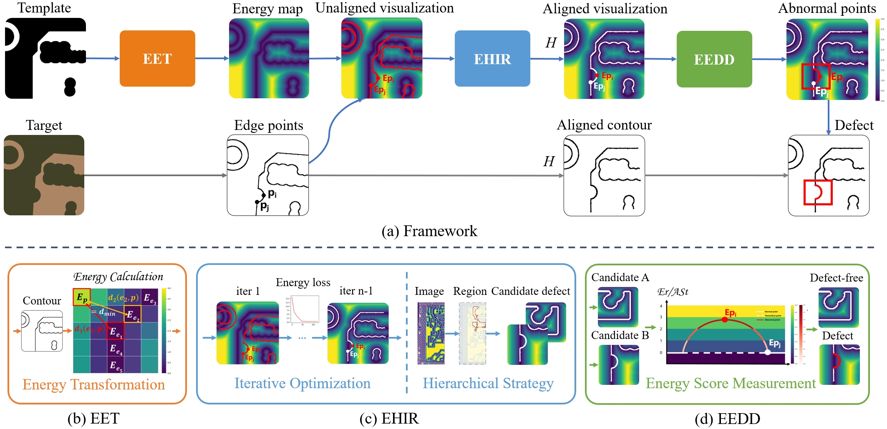

### EHIR
[Paper](https://www.sciencedirect.com/science/article/pii/S0167865524001983)

This repository is the official implementation of paper "EHIR: Energy-based Hierarchical Iterative Image Registration for Accurate PCB Defect Detection".

We propose EHIR (Energy-based Hierarchical Iterative Image Registration), a novel method that formulates image registration as an energy optimization problem using edge points instead of sparse features. This makes EHIR especially powerful in handling high-resolution images and those with scarce, dense, or degraded features, and significantly outperforms conventional feature-based methods.

Our method can be used for accurate PCB image registration and further reference-based defect detection (template image is required). Our framework consists of three stages: Edge-guided Energy Transformation (EET), Energy-based Hierarchical Iterative Image Registration (EHIR) and Edge-guided Energy-based Defect Detection (EEDD).

This approach can be extended to image registration problems characterized by prominent structural attributes.


<div align=center>

</div>

## Data Preparation
Please make sure that all template and target image pairs are placed together in a single directory (e.g., ./data). Each pair should be named in the following format: {name}_temp.jpg and {name}_test.jpg.

## Usage
You can align your images by running the following script:
```
python tools/align.py
```

## Acknowledgments
This work was contributed equally by Shuixin Deng and Lei Deng.

## Citation
If you find our work useful, please consider to cite our work.
```
@article{deng2024ehir,
  title={EHIR: energy-based hierarchical iterative image registration for accurate PCB defect detection},
  author={Deng, Shuixin and Deng, Lei and Meng, Xiangze and Sun, Ting and Chen, Baohua and Chen, Zhixiang and Hu, Hao and Xie, Yusen and Yin, Hanxi and Yu, Shijie},
  journal={Pattern Recognition Letters},
  volume={185},
  pages={38--44},
  year={2024},
  publisher={Elsevier}
}
```